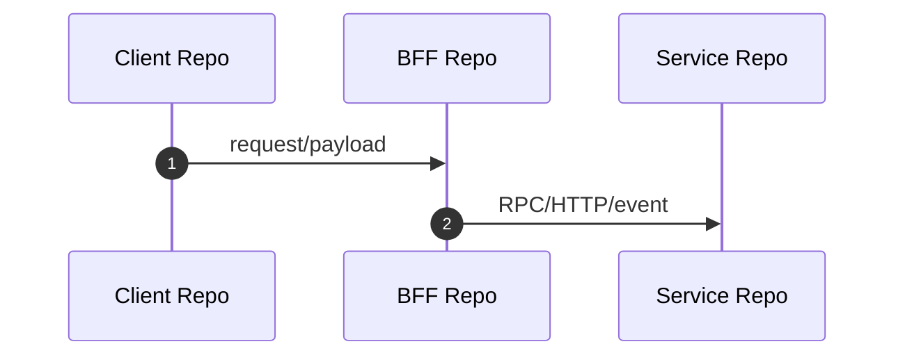

# Multi-Repo Dependency

Use this reference when a requirement crosses repositories, applications, backend services, BFF/gateway layers, domain services, message consumers, configuration platforms, SQL/material repositories, or shared libraries. By default, analyze backend code boundaries first. Include client/frontend repositories only when the requirement explicitly asks for them or backend evidence proves a contract coordination dependency.

## Repository Role Map

Record each repository's role before deep analysis:

```markdown
| Repository | Role | Backend boundary | Linked targets | Entrances | Downstream dependencies | Evidence | Confidence |
|---|---|---|---|---|---|---|---|
```

Common roles:

- client/app
- web/frontend
- BFF/gateway
- backend service
- domain service
- message producer
- message consumer
- shared SDK/library
- configuration/material repository
- observability/diagnostic service

## Code-Change Repository Decision

Classify every repository candidate before handoff:

| Decision | Meaning |
|---|---|
| Must change | Owned backend behavior, API/DTO contract, schema, query, config, job, listener, SDK contract, or data source must change for a target to pass. |
| May change | Repository likely participates, but source evidence is insufficient to prove a required code change. |
| No code change | Repository was checked and is only a caller/consumer, unaffected dependency, or runtime observer for this requirement. |
| Runtime/config only | No source edit proven, but runtime configuration, feature flag, data setup, remote service config, or migration may be required. |
| Unknown | Repository boundary or ownership cannot be confirmed from available evidence. |

Do not mark a repository `Must change` from call-chain presence alone. Prove ownership of the missing or changed behavior.

The handoff must expose code-change decisions by repository dimension. Start with one summary row per repository, then expand into per-repository `ChangeScope` sections. Do not only organize changes by target, class, endpoint, or call chain; those details must roll up to the owning repository.

## Per-Repository Change Scope

For each `Must change` or `May change` repository, record:

```markdown
### ChangeScope CS-001
- Repository/module:
- Decision: Must change / May change / Runtime/config only / No code change / Unknown
- Linked targets:
- Owned backend boundary:
- Why this repository is in scope:
- Likely files/classes/packages:
- API/DTO/contract changes:
- Service/domain logic changes:
- Data model/SQL/repository changes:
- Config/feature flag changes:
- Async/job/message changes:
- External dependency changes:
- Tests to add/update:
- Migration/runtime validation:
- Repositories it must coordinate with:
- Evidence:
- Confidence:
```

If no code change is required, state the exclusion reason and evidence, such as "caller only", "read-only downstream", "contract unchanged", or "runtime validation only".

If a repository is `Runtime/config only` or `Unknown`, still create a repository-level scope entry when it affects delivery planning. Explain what is runtime-only or what evidence is missing, so the planning handoff does not lose that repository.

## Dependency Edge Template

```markdown
### RepoDependency D-001
- Target ids:
- Upstream repository:
- Downstream repository:
- Direction:
- Interface/event/topic/SDK:
- Payload or key parameters:
- Sync/async:
- Ownership boundary:
- Evidence:
- Runtime dependency:
- Risk:
```

## Cross-Repository Rules

- Do not fetch entity sets from one repository/source and ownership/status/mapping data from another unless evidence proves the scopes match.
- Confirm both sides of an interface when possible: caller payload and callee handler.
- For events/messages, confirm publisher topic/payload and consumer subscription/handler.
- For shared SDKs, distinguish SDK method existence from actual service behavior.
- For clients, distinguish UI route/navigation from backend contract ownership.

## Sequence View

Use a cross-repository sequence when more than two repositories participate:



Mark static-only edges as `源码推断`. Mark missing runtime confirmation explicitly.

## Handoff Focus

End with:

- primary implementation owner
- required code-change repository list
- per-repository change scope and confidence
- repository-dimension summary of all `Must change`, `May change`, `Runtime/config only`, and unresolved `Unknown` repositories
- dependent repositories that must coordinate
- contracts/events/config that need change or verification
- repositories checked and excluded
- unresolved runtime or ownership risks
