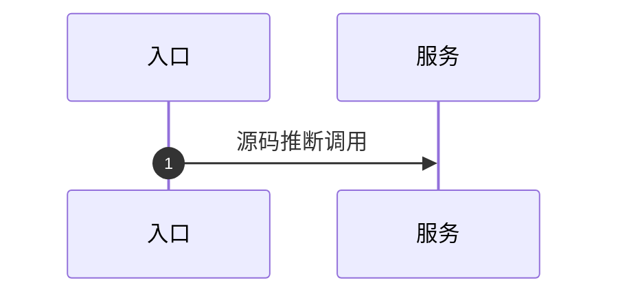

# Research Output Template

Use this template when writing or updating `research.md`. Keep sections concise, evidence-backed, and linked to target ids.

````markdown
# 依赖仓库考古 Research

## 输入与范围

- 需求输入：
- 输出文件：
- 已读取材料：
- 源码仓库地址/标识：
- 明确不在范围内：

## 需求目标提取

| Target | Claim | Verification question | Source hints | Status |
|---|---|---|---|---|
| T-001 |  |  |  | Requirement claim |

## 仓库与模块定位

| Repository/Module | Role | Linked targets | Evidence | Confidence |
|---|---|---|---|---|

## 仓库边界判定

- 默认分析域：后端代码
- 主实现仓库：
- 依赖后端仓库：
- 共享 SDK/契约仓库：
- 配置/SQL/数据仓库：
- 前端/客户端仓库是否纳入：
- 明确排除的仓库：

## 需改仓库清单

本节是“需要修改哪些仓库”的权威总表，必须按仓库维度列出，一行一个仓库或仓库/模块边界。不要只按 Target、入口、类名或模块散列变更点。

| Repository/Module | Decision | Linked targets | Owned backend boundary | Why in scope | Evidence | Confidence |
|---|---|---|---|---|---|---|
|  | Must change / May change / No code change / Runtime/config only / Unknown |  |  |  |  |  |

## 每仓库变更范围

本节必须与 `需改仓库清单` 一一对应：清单中每一个 `Must change`、`May change`、`Runtime/config only` 或 `Unknown` 仓库，都要有一个独立小节。小节标题使用仓库名或仓库路径，不要使用 Target id 作为一级分组。

### Repository/Module

- Decision:
- Linked targets:
- Owned backend boundary:
- Likely files/classes/packages:
- API/DTO/contract changes:
- Service/domain logic changes:
- Data model/SQL/repository changes:
- Config/feature flag changes:
- Async/job/message changes:
- External dependency changes:
- Tests to add/update:
- Migration/runtime validation:
- Coordinate with:
- Evidence:
- Confidence:

## 跨仓库依赖图

| Upstream repo | Downstream repo | Interface/Event/SDK | Direction | Targets | Evidence | Risk |
|---|---|---|---|---|---|---|

## 工具能力与边界记录

| Tool/Adapter | Repository | Inventory | Search | Read | Symbol | AST/PSI | Call Resolution | Notes |
|---|---|---:|---:|---:|---:|---:|---:|---|

### Codegraph

- `.codegraph/` 路径：
- 访问方式：MCP / CLI
- 状态结果：
- node/edge/file 数量：
- pending sync / stale-file 警告：
- 分支/commit：
- 覆盖模块/语言：
- 新鲜度：
- 已知盲区：
- 使用的工具/命令：
- 源码确认策略：

## 入口清单

| Entrance | Type | Route/Symbol | Repository/Module | Targets | Evidence |
|---|---|---|---|---|---|

## 能力地图

| Capability | Repository/Module | Boundary | Inputs | Outputs/Effects | Targets | Evidence |
|---|---|---|---|---|---|---|

> 高风险、跨仓库、运行时依赖或实现计划关键能力，使用 `references/product-capability-model.md` 的 full capability card 展开，不只保留表格摘要。

## 模块与边界

- 模块归属：
- 跨仓库/跨模块边界：
- 配置、构建变体或运行时边界：
- 排除的候选仓库/模块：

## 核心业务逻辑

### T-001

- 结论：
- 关键分支：
- 数据读取/写入：
- 事务、异常、重试：
- 证据：

## 调用链与时序



> 标注静态推断、异步、分支、运行时依赖和未验证部分。

## 数据来源与状态

| Data/State | Final source | Key parameters | Mapping scope | Targets | Evidence |
|---|---|---|---|---|---|

## AOP/事件/异步/任务

- AOP/拦截器/过滤器：
- 事件发布与订阅：
- 异步执行器/任务：
- 消息主题/消费者：
- 未验证运行时条件：

## 外部依赖

| Dependency | Type | Caller | Parameters/Payload | Runtime dependency | Evidence |
|---|---|---|---|---|---|

## 目标验证结论

| Target | Conclusion | Evidence level | Why sufficient | Remaining risk |
|---|---|---|---|---|
| T-001 | Confirmed / Partially confirmed / Not found / Runtime dependent / Unknown |  |  |  |

## 风险与未知

| Unknown | Impact | Evidence checked | Needed evidence | Next step |
|---|---|---|---|---|

## 运行时验证计划

| Runtime item | Why source is insufficient | Environment/data needed | Validation method | Expected observation | Risk |
|---|---|---|---|---|---|

## 证据索引

| ID | Repository | File/Symbol | Lines | Supports |
|---|---|---|---|---|

## 下一步建议

- 计划：
- 实现：
- 运行时验证：
- 需要用户补充：
````

## Writing Rules

- Prefer tables for target mapping, repository ownership, evidence index, and unknowns.
- Always expose the modified or potentially modified repositories by repository dimension first: `需改仓库清单` is the summary, and `每仓库变更范围` is the per-repository detail.
- Do not make the reader infer required repositories from scattered target sections, call chains, evidence indexes, or module notes.
- Put the decisive evidence near the conclusion it supports.
- Mark conclusions as `Confirmed`, `Partially confirmed`, `Not found`, `Runtime dependent`, or `Unknown`.
- Do not hide source mismatch with fallback wording. Name the mismatch and the smallest source-backed next step.
