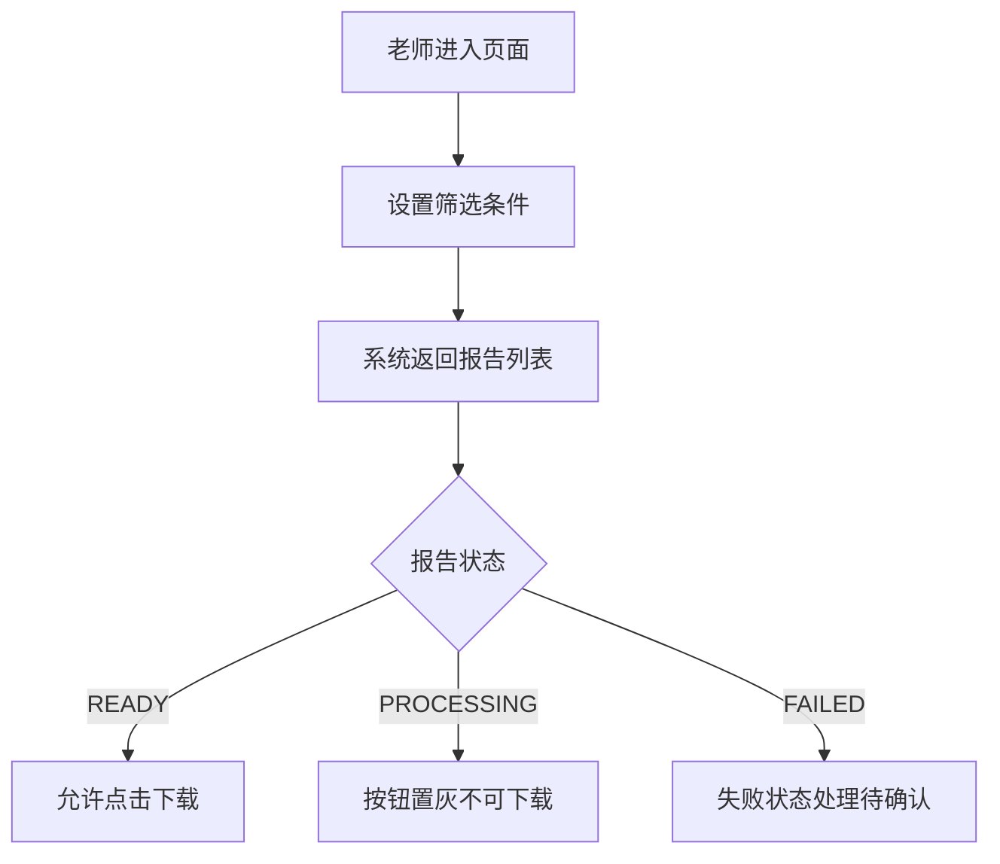
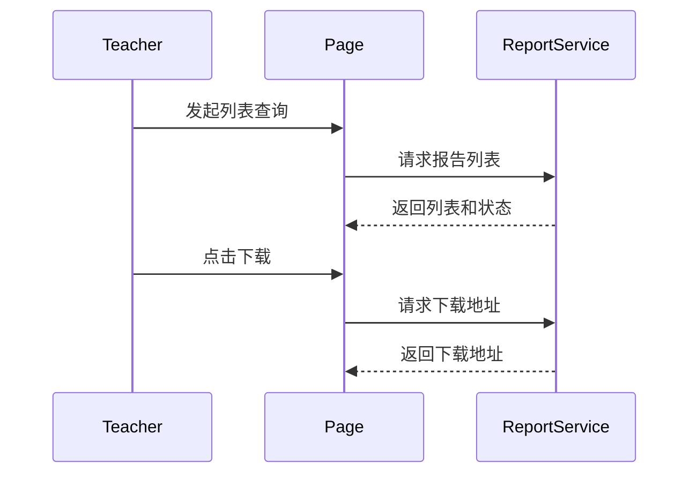

# 学习报告下载中心 AI 可执行规范文档

> 本文档是对原始 PRD/需求材料进行梳理、澄清和结构化整理后的结果，面向 AI 后续生成执行计划、任务拆分、代码实现与自动测试。
> 文档会显式区分“原始事实”“整理后归纳”“推断”“冲突信息”“未决问题”，不会把未确认内容伪装成确定需求。

## 1. 文档信息
- 来源：PRD 文字片段、页面草图说明、流程说明、时序说明、状态表、原型链接、接口草案链接
- 转换时间：示例
- 输入类型：文本 + 表格 + 链接
- 转换目标：供 AI 继续生成 implementation plan、任务拆分、代码实现与自动测试
- 确认状态：初稿

## 2. 需求目标与原始内容摘要
- 原始目标是在教练工作台新增“学习报告下载中心”
- 已明确老师可以按学生、时间范围、状态筛选报告
- 已明确老师可以下载已生成的 PDF 报告
- 已明确“生成中”状态不可点击下载
- 列表最多展示最近 90 天的报告
- 状态表包含 `FAILED`，但失败状态的后续动作未说明
- 正文写“家长端暂不开放”，但补充说明提到原型存在“家长视角切换”入口
- 下载链接有效期未说明

## 3. 术语与对象
- 角色：老师、学生、系统任务服务
- 页面/模块：学习报告下载中心、筛选区、报告列表
- 核心实体：学习报告、报告状态、下载地址
- 外部系统/依赖：报告服务、原型地址、接口草案链接

## 4. 功能需求
### 4.1 报告列表查询
- 原始描述：老师进入页面后可按学生、时间范围、状态筛选报告
- 整理后归纳：列表查询用于查看老师名下学生的学习报告，并根据报告状态决定后续可执行操作
- 推断：系统需要按老师身份过滤可见学生范围，但过滤细节原始材料未明确
- 冲突信息：无直接冲突；但与页面权限相关的“家长视角切换”入口会间接影响页面可见性判断
- 前置条件：老师已进入学习报告下载中心
- 用户操作：输入学生姓名，选择时间范围和状态
- 系统行为：请求报告服务并返回符合条件的报告列表
- 输出结果：展示报告列表
- 决策条件：筛选结果由学生、时间范围和状态共同决定；时间范围最多最近 90 天
- 异常/边界处理：无结果、查询失败、超出 90 天游范围时的处理原始材料未明确
- 业务约束：列表最多展示最近 90 天的报告
- 来源引用：目标、页面草图说明、补充说明、流程图说明、验收

### 4.2 报告下载
- 原始描述：已生成状态的报告允许下载
- 整理后归纳：只有处于 `READY` 或等价“已生成”状态的报告才开放下载按钮
- 推断：下载动作依赖服务端返回下载地址，可能存在时效或鉴权校验，但原始材料未明确
- 冲突信息：无直接冲突
- 前置条件：报告状态为“已生成”
- 用户操作：点击“下载”
- 系统行为：请求报告服务获取下载地址
- 输出结果：返回 PDF 报告下载地址
- 决策条件：只有 `READY` 状态允许下载
- 异常/边界处理：下载地址过期、下载失败、重复点击处理原始材料未明确
- 业务约束：下载链接有效期未确认
- 来源引用：目标、页面草图说明、时序说明、状态表、验收

### 4.3 生成中状态处理
- 原始描述：当报告还在生成中时，页面要展示“生成中”状态，且按钮不可点击
- 整理后归纳：`PROCESSING` 是明确的不可下载状态，前端需要阻止误操作
- 推断：若生成时间较长，可能需要刷新或轮询机制，但原始材料未明确
- 冲突信息：无直接冲突
- 前置条件：报告状态为“生成中”
- 用户操作：查看报告列表
- 系统行为：操作按钮置灰，不可点击
- 输出结果：用户只能看到“生成中”状态，不可触发下载
- 决策条件：状态值为 `PROCESSING` 时强制禁止下载
- 异常/边界处理：生成超时、失败后是否自动刷新原始材料未明确
- 业务约束：原始材料未明确
- 来源引用：目标、页面草图说明、状态表、验收

### 4.4 失败状态处理
- 原始描述：状态表包含 `FAILED`，展示文案为“生成失败”，允许下载列未说明
- 整理后归纳：`FAILED` 是显式状态，但失败后的用户可见信息和可执行动作尚未被定义
- 推断：至少应明确是否展示失败原因、是否允许重试、是否保留历史可下载文件
- 冲突信息：状态表已出现 `FAILED`，但正文、流程和验收都没有对应规则，属于信息缺失而非明确冲突
- 前置条件：报告状态为 `FAILED`
- 用户操作：查看失败记录
- 系统行为：原始材料未明确
- 输出结果：原始材料未明确
- 决策条件：失败状态下的展示与操作规则未确认
- 异常/边界处理：失败原因、重试、历史文件下载、超时转失败规则均未确认
- 业务约束：原始材料未明确
- 来源引用：状态表、补充说明、验收

## 5. 关键业务规则与约束
- 角色权限：文字说明当前只有老师可操作；家长和学生是否可见未确认
- 状态流转：至少存在 `READY`、`PROCESSING`、`FAILED` 三种状态；`FAILED` 后续流转未确认
- 时间/次数/范围限制：列表仅展示最近 90 天报告
- 决策规则：是否允许下载由报告状态决定
- 数据约束：报告列表应限定在老师名下学生范围，但映射规则未确认
- 其他业务限制：原型中的“家长视角切换”入口与正文权限说明存在冲突

## 6. 非功能与约束
- 性能：原始材料未明确
- 权限：明确老师可操作；家长和学生的可见性与可操作性未确认
- 安全：下载链接时效、鉴权方式未确认
- 兼容性：原始材料未明确
- 埋点/日志：原始材料未明确
- 文案/国际化：状态文案包含“已生成”“生成中”“生成失败”
- 其他限制：原始材料未明确

## 7. 页面与交互
- 页面列表：学习报告下载中心
- 关键组件：学生姓名搜索框、时间范围选择器、状态筛选下拉框、报告列表、操作按钮
- 关键状态：已生成、生成中、生成失败
- 空态/异常态：原始材料未明确
- 交互备注：生成中状态按钮置灰；已生成状态显示“下载”按钮；失败状态交互未确认；家长视角入口用途未确认

## 8. 流程与时序
### 8.1 业务流程

### 8.2 时序

## 9. 表格转录
### 9.1 报告状态表
| 状态值 | 展示文案 | 允许下载 |
| --- | --- | --- |
| READY | 已生成 | 是 |
| PROCESSING | 生成中 | 否 |
| FAILED | 生成失败 | 未说明 |

说明：
`FAILED` 状态下是否允许重试、是否允许下载历史文件、是否展示失败原因，原始材料未明确。

## 10. 图片与图示说明
### 10.1 页面草图说明
- 原图用途：说明下载中心页面的基本布局和交互
- 原图链接/来源：原型地址 https://example.com/prototype/report-center
- 权限状态：未确认
- 拉取状态：未提供
- 打开查看状态：未确认
- 失败原因：
- 关键可见信息：顶部有学生姓名搜索框、时间范围选择器、状态筛选下拉框；列表包含学生姓名、报告类型、生成时间、状态、操作按钮
- 已回写章节：4.1 报告列表查询，4.2 报告下载，7. 页面与交互
- 与功能的对应关系：支撑列表查询、状态展示和下载操作
- 当前处理：依据文字版“页面草图说明”完成提取
- 补充状态：已回写
- 建议补充方式：
- 无法识别/待确认：原型中的“家长视角切换”入口仅在补充说明中被提及，未见其用途定义

## 11. 链接与引用资料
- [原型地址](https://example.com/prototype/report-center) - 页面原型参考
- [接口草案](https://example.com/api/report-center) - 报告列表与下载接口参考

## 12. 验收标准
- 老师可以看到自己名下学生的报告列表
- 已生成状态的报告可以下载
- 生成中的报告不可点击下载
- 建议补充验收点：失败状态的展示与处理方式。该项不是原始确认项
- 建议补充验收点：家长和学生对该页面的可见性与可操作性。该项不是原始确认项

## 13. 未决问题与歧义
### 13.1 已确认项回写记录
- 问题：原始材料尚未进入用户确认轮次
- 用户确认：无
- 已回写章节：无

### 13.2 待逐条确认问题
- 问题类型：冲突
- 优先级：P0
- 确认方式：单条
- 问题：原型中的“家长视角切换”入口是原型残留，还是本期能力的一部分？
- 为什么需要确认：直接影响页面可见性、权限判断、路由与验收口径
- 影响章节：5.关键业务规则与约束，6.非功能与约束，7.页面与交互，12.验收标准
- 候选解释：A. 原型残留，应移除；B. 家长可只读查看但不可下载；C. 后续规划，本期入口不开放
- 当前暂行写法：仅保留“老师可操作”为已知事实，家长相关能力全部标记为 `未确认`
- 是否为用户授权推断：否
- 建议补充方式：直接回复 A / B / C，或给出更准确说明
- 若暂无法确认：保留为 `未确认` 或留空，不写成确定需求

- 问题类型：规则待确认
- 优先级：P0
- 确认方式：单条
- 问题：`FAILED` 状态下是否展示失败原因、是否允许重试、是否允许下载历史文件？
- 为什么需要确认：直接影响状态机、前端交互、接口行为和测试断言
- 影响章节：4.功能需求，5.关键业务规则与约束，7.页面与交互，8.流程与时序，9.表格转录，12.验收标准
- 候选解释：A. 仅展示失败原因；B. 展示失败原因并允许重试；C. 允许下载历史成功文件；D. 失败仅展示，不提供任何操作
- 当前暂行写法：`FAILED` 状态仅视为显式状态存在，后续行为全部标记为 `未确认`
- 是否为用户授权推断：否
- 建议补充方式：直接回复 A / B / C / D，或给出更准确说明
- 若暂无法确认：保留为 `未确认` 或留空，不写成确定需求

- 问题类型：缺失
- 优先级：P1
- 确认方式：批量
- 问题：请一起确认以下 3 个列表交互细节：1. 无结果空态文案；2. 查询失败提示方式；3. 超出 90 天游范围时的处理方式。
- 为什么需要确认：会影响页面交互、异常处理和验收细则，但不阻塞核心角色权限判断
- 影响章节：4.功能需求，7.页面与交互，12.验收标准
- 候选解释：A. 页面级通用提示；B. 空态、失败态、超范围分别独立处理；C. 后端兜底，前端仅展示通用失败
- 当前暂行写法：三项交互细节全部标记为 `未确认`
- 是否为用户授权推断：否
- 建议补充方式：按 1 / 2 / 3 序号回复，或先保留未确认
- 若暂无法确认：保留为 `未确认` 或留空，不写成确定需求

- 问题类型：规则待确认
- 优先级：P1
- 确认方式：单条
- 问题：下载链接的有效期和鉴权方式是什么？
- 为什么需要确认：影响安全方案、接口设计和验收边界
- 影响章节：4.功能需求，6.非功能与约束，12.验收标准，14.AI 执行提示
- 候选解释：A. 短时效签名链接；B. 登录态校验后直接下载；C. 二者同时存在
- 当前暂行写法：不假设任何下载安全策略
- 是否为用户授权推断：否
- 建议补充方式：补充安全方案说明 / 提供接口约束 / 暂时保留未确认
- 若暂无法确认：保留为 `未确认` 或留空，不写成确定需求

### 13.3 暂未确认/留空项
- 问题类型：冲突
- 字段/问题：家长和学生的页面可见性
- 原因：正文和补充说明存在权限冲突，且未见正式权限定义
- 对实现的影响：影响路由可见性、权限校验和验收口径

- 问题类型：规则待确认
- 字段/问题：`FAILED` 状态的展示、按钮和状态流转
- 原因：状态表存在该状态，但正文、流程和验收未覆盖处理规则
- 对实现的影响：影响状态机、前端分支和自动化测试设计

## 14. AI 执行提示
- 后续可直接用于生成 implementation plan
- 后续可直接用于拆分任务
- 后续可直接用于生成代码与测试
- 禁止假设的关键空白点：家长入口权限、失败状态交互、下载链接时效与鉴权、空态与异常态、查询失败处理

## 15. 下游 Skill 数据契约

### 15.1 Planner Skill 消费指南
| 章节优先级 | 章节 | 用途 |
|-----------|------|------|
| 必须消费 | §4 功能需求 | 任务拆分的核心依据 |
| 必须消费 | §5 关键业务规则与约束 | 判定逻辑与约束实现依据 |
| 必须消费 | §14 AI 执行提示 | 禁止假设的风险点 |
| 建议消费 | §13 未决问题与歧义 | 标注阻塞点与风险点 |

### 15.2 未决问题处理规则
- `§13.1` 可视为已确认事实
- `§13.2` 只能作为待确认阻塞点，不能当成已确认需求
- `§13.3` 只能作为风险点，不能补写成确定实现

### 15.3 文档状态与下游行为
- `初稿`：建议优先完成关键确认
- `部分已确认`：已确认部分可继续推进，未确认部分标记风险
- `已完成确认`：可直接进入实现
- `确认未完成`：优先补关键阻塞点
