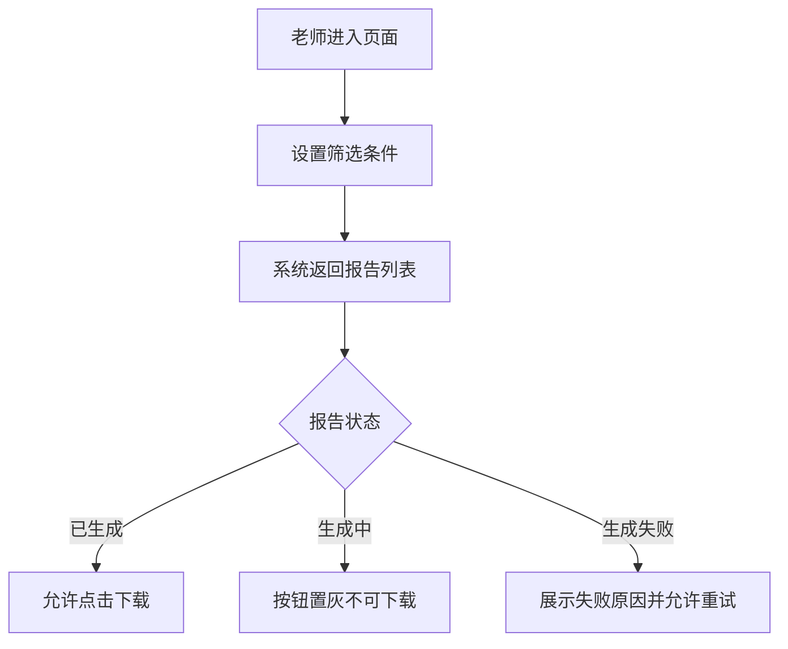
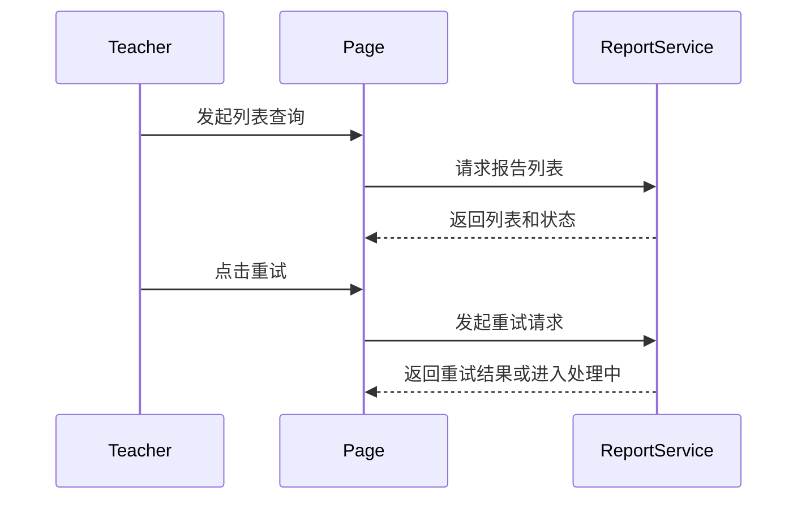

# 完整示例：学习报告下载中心需求澄清闭环

> 这个示例展示 `prd-clarifier` 的完整闭环：首轮草稿、自动冲突检测、逐条确认、批量确认、图片自动下载/打开、图片补充提醒，以及把确认结果回写到主文档。

## 1. 原始输入概览

输入材料包含：

- PRD 文字说明
- 页面草图说明
- 状态表
- 原型链接
- 接口草案链接
- 一张自动拉取失败的失败态截图

已知原始问题：

- 正文写“家长端暂不开放”，但原型出现“家长视角切换”入口
- 状态表包含 `FAILED`，但没有说明失败态如何处理
- 下载链接有效期未说明
- 查询失败、空态、超出 90 天游范围的交互未说明
- 一张失败态截图拉取失败

## 2. 首轮自动冲突检测结果

### 2.1 权限冲突
- 冲突点：正文写明“老师可操作，家长端暂不开放”，原型中却出现“家长视角切换”入口
- 来源：背景说明、补充说明、原型截图
- 风险：影响路由可见性、按钮权限、验收口径
- 处理：归类为 `P0 冲突`，单条确认

### 2.2 状态与操作缺失
- 问题点：状态表包含 `FAILED`，但“是否可重试、是否显示错误原因、是否允许下载历史文件”未定义
- 来源：状态表、页面草图、验收条件
- 风险：影响前端状态分支、接口调用、测试断言
- 处理：归类为 `P0 规则待确认`，单条确认

### 2.3 同模块缺失项，适合批量确认
- 缺失点：无结果空态文案、查询失败提示方式、超出 90 天游范围处理方式
- 来源：页面草图、流程说明、验收说明均未覆盖
- 风险：影响列表查询体验和测试覆盖，但不阻塞核心权限判断
- 处理：归类为 `P1 缺失`，批量确认

## 3. 首轮确认提问示例

### 3.1 单条确认：权限冲突
```text
问题：原型中的“家长视角切换”入口是原型残留，还是本期能力的一部分？
为什么需要确认：会直接影响权限范围、路由可见性和验收口径。
影响章节：5.关键业务规则与约束，6.非功能与约束，7.页面与交互，12.验收标准。

候选解释：
A. 原型残留，应移除
B. 家长可只读查看，但不可下载
C. 这是后续规划，本期入口不开放
```

### 3.2 单条确认：失败态规则
```text
问题：`FAILED` 状态下是否展示失败原因、是否允许重试、是否允许下载历史文件？
为什么需要确认：会直接影响状态分支、交互按钮和测试断言。
影响章节：4.功能需求，5.关键业务规则与约束，7.页面与交互，8.流程与时序，9.表格转录，12.验收标准。

候选解释：
A. 仅展示失败原因
B. 展示失败原因并允许重试
C. 支持下载历史成功文件
D. 失败仅展示，不提供任何操作
```

### 3.3 批量确认：同模块交互细节
```text
下面是同一模块的 3 个待确认点，我合并一轮确认以提高效率。请按序号直接回复即可；如果某一项现在无法确认，请回复“未确认”。

1. 无结果时的空态文案或展示方式是什么？
2. 查询失败时是 toast、页面错误提示，还是表格内提示？
3. 超出 90 天游范围时是前端禁选、提交时报错，还是后端兜底拦截？
```

### 3.4 图片权限申请示例
```text
图片“教练工作台页面截图”当前不是链接失效，而是需要额外权限才能下载或打开。我需要先拿到访问权限，才能继续确认筛选区字段、列表按钮和状态标注。

如果你同意，请授权我继续拉取这张图片；如果暂时不能授权，我会先把相关内容保留为 `未确认`，并在文档中记录权限阻塞和影响范围。
```

### 3.5 图片补充提醒
```text
图片“报告失败态截图”我已尝试下载并打开，但当前无法读取，会影响我确认失败态按钮、错误提示和是否支持重试。

请你任选一种方式补充：
1. 重新上传这张图片
2. 直接用文字描述图片里的字段、按钮、状态、提示文案和标注
3. 提供一个新的可访问图片链接
4. 先保留为未确认，后续再补
```

## 4. 用户回答示例

用户给出的确认结果如下：

- 权限冲突：选 `A`，家长视角切换是原型残留，本期应移除
- 失败态规则：选 `B`，展示失败原因并允许重试
- 批量确认：
  - 1. 无结果时显示“暂无符合条件的学习报告”
  - 2. 查询失败使用列表上方错误提示，不使用 toast
  - 3. 超出 90 天游范围由前端禁选
- 图片补充：用户暂时无法提供，保留 `未确认`
- 图片权限：当前示例中的两张图片均无需额外权限申请

## 5. 回写后的最终文档

# 学习报告下载中心 AI 可执行规范文档

> 本文档是对原始 PRD/需求材料进行梳理、澄清和结构化整理后的结果，面向 AI 后续生成执行计划、任务拆分、代码实现与自动测试。
> 文档会显式区分“原始事实”“整理后归纳”“推断”“冲突信息”“未决问题”，不会把未确认内容伪装成确定需求。

## 1. 文档信息
- 来源：PRD 文字片段、页面草图说明、流程说明、时序说明、状态表、原型链接、接口草案链接、失败态截图链接
- 转换时间：示例
- 输入类型：文本 + 图示说明 + 表格 + 链接 + 失败图片外链
- 转换目标：供 AI 继续生成 implementation plan、任务拆分、代码实现与自动测试
- 确认状态：部分已确认

## 2. 需求目标与原始内容摘要
- 原始目标是在教练工作台新增“学习报告下载中心”
- 本期仅老师可操作，家长入口为原型残留，应移除
- 页面支持按学生、时间范围、状态筛选报告
- 报告列表展示学生姓名、报告类型、生成时间、状态、操作按钮
- 状态为“已生成”时允许下载
- 状态为“生成中”时按钮置灰且不可点击
- 状态为“生成失败”时显示失败原因并允许重试
- 列表最多展示最近 90 天的报告

## 3. 术语与对象
- 角色：老师、学生、系统任务服务
- 页面/模块：学习报告下载中心、报告列表、筛选区
- 核心实体：学习报告、报告状态、下载地址、失败原因
- 外部系统/依赖：报告服务、原型地址、接口草案链接

## 4. 功能需求
### 4.1 报告列表查询
- 原始描述：老师进入页面后可按学生、时间范围、状态筛选报告
- 整理后归纳：列表查询用于查看老师名下学生在最近 90 天内的报告结果，并根据状态决定后续操作
- 推断：系统需要按老师身份过滤学生范围，但过滤细则仍未细化
- 冲突信息：无直接冲突
- 前置条件：老师已进入学习报告下载中心，且系统能识别老师名下学生范围
- 用户操作：输入学生姓名，选择时间范围和状态
- 系统行为：请求报告服务并返回符合条件的报告列表
- 输出结果：展示报告列表；无结果时显示“暂无符合条件的学习报告”
- 决策条件：只展示最近 90 天数据；筛选结果按学生、时间和状态共同决定；超出 90 天游范围由前端禁选
- 异常/边界处理：查询失败时在列表上方展示错误提示，不使用 toast
- 业务约束：列表最多展示最近 90 天的报告
- 来源引用：背景、目标、页面草图说明、流程图说明、用户确认

### 4.2 报告下载
- 原始描述：已生成状态的报告允许下载
- 整理后归纳：下载行为依赖报告状态，只有已生成状态才开放可点击下载入口
- 推断：下载链接大概率存在时效或鉴权控制，但当前未确认
- 冲突信息：无直接冲突
- 前置条件：报告状态为“已生成”
- 用户操作：点击“下载”
- 系统行为：请求报告服务获取下载地址
- 输出结果：返回可用于下载 PDF 报告的地址
- 决策条件：报告状态必须为 `READY` 或等价的“已生成”状态
- 异常/边界处理：下载地址过期、下载失败、重复点击的处理仍未确认
- 业务约束：下载链接有效期未确认
- 来源引用：目标、页面草图说明、时序说明、验收

### 4.3 失败状态处理
- 原始描述：状态表包含 `FAILED`，但原始材料未说明处理方式
- 整理后归纳：失败状态需要展示失败原因并允许用户发起重试
- 推断：失败原因可能来自服务端错误码映射，但当前没有明确字典
- 冲突信息：无直接冲突，但失败态规则原始材料显著缺失
- 前置条件：报告状态为 `FAILED`
- 用户操作：查看失败记录，点击“重试”
- 系统行为：展示失败原因，并触发重试逻辑
- 输出结果：用户可以看到失败原因；若触发重试，状态流转规则待后续细化
- 决策条件：仅 `FAILED` 状态展示失败原因和“重试”操作
- 异常/边界处理：重试次数限制、重试中的按钮状态仍未确认
- 业务约束：失败原因文案来源和错误码映射仍未确认
- 来源引用：状态表、用户确认

## 5. 关键业务规则与约束
- 角色权限：本期仅老师可操作；家长入口为原型残留，应移除
- 状态流转：至少存在 已生成 / 生成中 / 生成失败 三种状态；失败状态允许重试
- 时间/次数/范围限制：列表仅展示最近 90 天报告；超出范围由前端禁选
- 决策规则：是否允许下载由报告状态决定；失败状态展示失败原因并允许重试
- 数据约束：报告列表需要绑定老师名下学生范围，但过滤规则细节仍未确认
- 其他业务限制：下载链接有效期与鉴权方式仍未确认

## 6. 非功能与约束
- 性能：原始材料未明确
- 权限：老师可操作；家长和学生不可见该页面
- 安全：下载链接有效期与鉴权方式未确认
- 兼容性：原始材料未明确
- 埋点/日志：建议记录查询失败、下载失败、重试触发日志
- 文案/国际化：空态文案为“暂无符合条件的学习报告”；失败提示为列表上方错误提示
- 其他限制：原始材料未明确

## 7. 页面与交互
- 页面列表：学习报告下载中心
- 关键组件：学生姓名搜索框、时间范围选择器、状态筛选下拉框、报告列表、下载按钮、失败原因展示区、重试按钮
- 关键状态：已生成、生成中、生成失败
- 空态/异常态：无结果显示“暂无符合条件的学习报告”；查询失败显示列表上方错误提示
- 交互备注：生成中状态按钮置灰；已生成状态显示“下载”按钮；失败状态显示失败原因并允许重试

## 8. 流程与时序
### 8.1 业务流程


### 8.2 时序


## 9. 表格转录
### 9.1 报告状态表
| 状态值 | 展示文案 | 允许下载 | 允许重试 |
| --- | --- | --- | --- |
| READY | 已生成 | 是 | 否 |
| PROCESSING | 生成中 | 否 | 否 |
| FAILED | 生成失败 | 否 | 是 |

说明：
`FAILED` 状态允许重试为用户确认结果；下载历史文件、重试次数限制仍未确认。

## 10. 图片与图示说明
### 10.1 页面草图说明
- 原图用途：说明下载中心页面的基本布局和交互
- 原图链接/来源：https://example.com/prototype/report-center
- 权限状态：无需权限
- 拉取状态：成功
- 打开查看状态：已打开查看
- 失败原因：
- 关键可见信息：筛选区包含学生姓名、时间范围、状态；列表包含学生姓名、报告类型、生成时间、状态、操作按钮
- 已回写章节：4.1 报告列表查询，4.2 报告下载，7.页面与交互
- 与功能的对应关系：支撑列表查询、状态展示、下载操作
- 当前处理：已完成提取，无需补充
- 补充状态：已回写
- 建议补充方式：
- 无法识别/待确认：无

### 10.2 报告失败态截图
- 原图用途：补充说明 `FAILED` 状态的按钮和提示文案
- 原图链接/来源：https://example.com/assets/report-failed-state.png
- 权限状态：无需权限
- 拉取状态：失败
- 打开查看状态：无法打开
- 失败原因：外链无法访问或安全校验失败
- 关键可见信息：未获取，当前无法可靠识别
- 已回写章节：无
- 与功能的对应关系：影响失败态按钮文案、失败原因展示形式和重试入口位置
- 当前处理：已尝试下载并打开，但因外链不可访问未能完成识别，待用户补充图片信息
- 补充状态：待补充
- 建议补充方式：重新上传图片 / 提供失败态文字描述 / 提供新的可访问链接 / 暂时保留未确认
- 无法识别/待确认：失败态按钮文案、失败原因展示形式、是否有辅助说明文案

## 11. 链接与引用资料
- [原型地址](https://example.com/prototype/report-center) - 页面原型参考
- [接口草案](https://example.com/api/report-center) - 报告列表与下载接口参考

## 12. 验收标准
- 老师可以看到自己名下学生的报告列表
- 家长入口在本期页面中不出现
- 已生成状态的报告可以下载
- 生成中的报告不可点击下载
- 生成失败状态展示失败原因并提供重试入口
- 建议补充验收点：下载链接时效与鉴权方式。该项不是原始确认项

## 13. 未决问题与歧义
### 13.1 已确认项回写记录
- 问题：原型中的“家长视角切换”入口是否属于本期能力
- 用户确认：原型残留，本期应移除
- 已回写章节：2.需求目标与原始内容摘要，5.关键业务规则与约束，6.非功能与约束，12.验收标准

- 问题：`FAILED` 状态下是否允许重试
- 用户确认：展示失败原因并允许重试
- 已回写章节：4.功能需求，5.关键业务规则与约束，7.页面与交互，8.流程与时序，9.表格转录，12.验收标准

- 问题：无结果、查询失败、超出 90 天游范围的列表交互
- 用户确认：空态文案为“暂无符合条件的学习报告”；查询失败显示列表上方错误提示；超出范围由前端禁选
- 已回写章节：4.功能需求，6.非功能与约束，7.页面与交互

### 13.2 待逐条确认问题
- 问题类型：规则待确认
- 优先级：P1
- 确认方式：单条
- 问题：下载链接的有效期和鉴权方式是什么？
- 为什么需要确认：影响安全方案、接口设计和验收边界
- 影响章节：4.功能需求，6.非功能与约束，12.验收标准，14.AI 执行提示
- 候选解释：A. 短时效签名链接；B. 登录态校验后直接下载；C. 二者同时存在
- 当前暂行写法：不假设任何下载安全策略
- 是否为用户授权推断：否
- 建议补充方式：补充安全方案说明 / 提供接口约束 / 暂时保留未确认
- 若暂无法确认：保留为 `未确认` 或留空，不写成确定需求

- 问题类型：图片补充
- 优先级：P1
- 确认方式：单条
- 问题：请补充“报告失败态截图”的图片信息。优先确认失败态按钮文案、失败原因展示形式、是否有辅助说明文案。
- 为什么需要确认：影响失败态 UI 细节、测试截图断言和交互文案
- 影响章节：4.功能需求，7.页面与交互，10.图片与图示说明，12.验收标准
- 候选解释：A. 仅展示失败原因；B. 展示失败原因并提供重试；C. 仅展示失败图标，不提供操作
- 当前暂行写法：失败态存在“失败原因 + 重试”规则，但 UI 细节全部保留未确认
- 是否为用户授权推断：否
- 建议补充方式：重新上传图片 / 直接描述截图中的字段和按钮 / 提供新的可访问链接 / 暂时保留未确认
- 若暂无法确认：保留为 `未确认` 或留空，不写成确定需求

### 13.3 暂未确认/留空项
- 问题类型：规则待确认
- 字段/问题：下载链接时效和鉴权方式
- 原因：原始材料未给出安全约束
- 对实现的影响：影响接口签名、下载权限控制和验收方案

- 问题类型：图片补充
- 字段/问题：失败态 UI 细节
- 原因：图片拉取失败，用户暂未补充
- 对实现的影响：影响按钮文案、错误提示展示和视觉验收

## 14. AI 执行提示
- 后续可直接用于生成 implementation plan
- 后续可直接用于拆分任务
- 后续可直接用于生成代码与测试
- 禁止假设的关键空白点：下载链接时效、鉴权方式、失败态 UI 细节

## 15. 下游 Skill 数据契约

### 15.1 Planner Skill 消费指南
| 章节优先级 | 章节 | 用途 |
|-----------|------|------|
| 必须消费 | §4 功能需求 | 任务拆分核心依据 |
| 必须消费 | §5 关键业务规则与约束 | 判定逻辑依据 |
| 必须消费 | §14 AI 执行提示 | 风险点与禁止假设项 |
| 建议消费 | §13 未决问题与歧义 | 标注阻塞点与风险点 |

### 15.2 未决问题处理规则
- `§13.1` 已确认项可直接用于计划
- `§13.2` 只能标为待确认阻塞点，不能视为已确认需求
- `§13.3` 只能标为风险点，等待后续澄清

### 15.3 文档状态与下游行为
- `部分已确认`：先处理已确认部分，未确认部分标注风险
- `确认未完成`：优先回到澄清环节，补关键阻塞点
