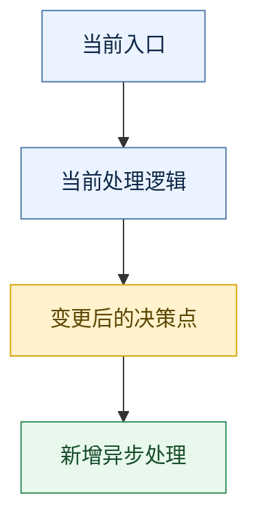

# Writing Backend Technical Solutions

## Overview

把“已澄清需求文档 + 当前代码事实”整理成一份可直接进入开发评审的后端详细技术方案。

这个 skill 的目标不是复述需求，也不是输出一份空泛模板，而是先核对当前代码真实基线，再说明目标方案、关键改动、图表、数据变更、测试与风险。方案必须同时回答两件事：

- 当前后端真实是怎么工作的
- 为满足目标需求，后端要在什么地方做什么增量改造

如果输入里同时有原始需求文档和澄清文档：

- 以澄清文档作为目标需求主依据
- 以当前代码作为现状事实主依据
- 原始需求文档只作为补充来源，不得覆盖已澄清结论

如果需求材料仍然散乱、冲突或缺关键信息，先使用 `prd-clarifier`，不要跳过澄清直接写方案。

## When to Use

适用场景：

- 用户要求“后端技术方案”“后端详细设计”“后端实现方案”“技术方案评审稿”“详细设计评审稿”，或明确要求把接口设计纳入一份完整后端方案
- 输入包含已澄清需求文档，且需要结合当前代码逻辑输出一份可评审的完整方案
- 输入同时包含原始 PRD 和澄清文档，需要在方案里体现“现状 vs 目标”的差距
- 用户明确要求流程图、时序图、核心改动、新旧逻辑差异、数据 / SQL / 存储变更、依赖、测试或风险分析
- 用户希望在编码前先形成可评审的后端设计文档

不适用场景：

- 需求还没有澄清，核心业务规则、状态机或边界条件仍不稳定
- 没有现有代码仓库或代码基线，只是从零设计一个新后端系统
- 用户只要轻量摘要，不需要进入开发设计
- 用户只想补一小段接口字段说明、单个 SQL 草稿或局部实现思路，不需要完整方案骨架
- 用户要的是前端视觉稿、交互稿或纯产品方案

边界场景：局部交付模式：

- 如果用户只要求某个局部产物，例如“后端改造落点图”“单张关键流程图”“单个用例时序图”“局部接口设计草稿”，可以复用本 skill 的局部规则，但不要进入完整方案主流程。
- 局部交付模式下，不强制输出完整模板，不强制补齐现状、差距、测试、发布回滚、风险等所有章节，也不要把局部产物命名成“完整后端方案”或“最终版方案”。
- 一旦用户进一步要求“可评审的完整方案”“完整技术方案骨架”，或要求补齐现状、差距、测试、发布回滚、风险，再切回完整方案主流程。

## Core Rules

- 进入主流程前，必须先做一次请求分流判定：`完整方案模式` / `局部交付模式` / `不适用或转向模式`。不要只因为用户提到“接口设计”“流程图”“SQL”“技术方案”这些关键词，就默认进入完整方案主流程。
- `局部交付模式` 下，标题和开头必须显式标注“局部交付”或等价表述；禁止把局部产物命名成“完整方案”“最终版方案”“评审终稿”。
- 永远把“代码现状”和“需求目标”分开写，禁止混成同一层描述。
- 永远显式标注“当前代码基线”，不要把需求中的目标能力写成“现状已支持”。
- 先读真实代码，再写方案。至少要落到实际模块、类、方法、表、SQL 或配置，不接受只凭需求臆测。
- 如果代码与澄清文档冲突，必须单独列出“需求与当前代码差距”，不要替任何一方静默圆场。
- 如果存在高影响的模糊边界、缺失规则、歧义口径或代码无法确认的关键逻辑，禁止静默假设后直接成稿，必须暂停并由人逐项确认。
- 所谓“高影响”，至少包括：主状态流转、接口入参/出参语义、统计口径、任务边界、数据归属、MQ/异步语义、DDL/SQL 口径、兼容策略、上下游职责划分。
- 确认问题必须一次只提一个，优先确认当前最阻塞、最影响方案正确性的那个点，不要把多个独立歧义揉成一段开放式大问题。
- 确认问题必须写清 5 件事：`当前观察`、`影响点`、`可选方案`、`推荐方案`、`待确认问题`。不要只问“要不要加锁”“要不要上缓存”这类脱离上下文的问题。
- `当前观察` 必须基于真实需求或代码事实；`影响点` 必须说明不确认会卡住哪部分方案；`可选方案` 只列当前真正可行的 1~3 个；`推荐方案` 要说明为什么；`待确认问题` 必须是一个可直接回答的单点决策。
- 用户尚未确认的高影响歧义，不能写成“当前方案已定”；只能标记为 `待确认`，并说明它会影响哪些章节或哪些技术决策。
- “整体架构设计”不能只写改动落点；在分析需求和当前代码时，要从架构层判断当前场景是否涉及：设计模式、缓存、锁、性能、并发、安全、幂等、异步化、是否需要引入新技术或中间件。
- 这些架构考量是“按场景触发”的，不是固定 checklist。只有当当前需求、现有代码或预期风险真的涉及某一项时，才展开分析并给出方案。
- 如果分析后判断某项与本次方案无关，可以直接跳过，不需要为了形式完整而逐项补“无”。
- 但如果某项是否需要引入会明显影响方案选择，就必须明确写出可选方案、推荐方案和原因；若缺少关键前提，则暂停并向人确认，而不是先拍板。
- 架构取舍评估的目标只有一个：帮助人选出当前上下文下最合适的方案，而不是堆砌“看起来高级”的技术名词。
- 图表必须显式区分“后端改造落点图”和“关键流程图”。前者回答“改哪里、谁负责”，后者回答“从触发点开始怎么跑、哪里改了”；两者不能互相替代。
- 关键流程图必须体现原逻辑与改动点，不能只画目标态。
- 关键流程图必须从实际触发点开始，例如接口入口、任务触发、消息消费或用户动作；不要从抽象分层框图直接起笔。
- 关键流程图优先围绕“本次改动落在哪个功能模块/功能入口”展开，只在该模块主流程里展示必要的老逻辑、修改逻辑和新增逻辑；复杂场景要拆成多张子流程图，不要一张图包打天下。
- 变更点和新增点必须可视化区分，不能靠正文一句“这里有改动”带过。
- 时序图按“任务/用例”组织，不要堆成类图式的接口名单。
- 时序图里的 participant 默认必须使用交互分层概念，而不是类名；优先使用：前端、某后端功能模块、第三方服务、Redis、数据库、MQ、定时任务、消息消费者等。
- 如果一个 participant 背后实际涉及多个类，图中仍然只保留“功能模块/交互角色”这一层；具体类名只写在图下方的“实现映射”里。
- 数据存储变更必须说明影响到的表、字段、索引、键、读写口径、兼容性和历史数据处理策略；如果没有 SQL 或存储变更，也要明确写“无”。
- 测试不能只写“自测”，至少覆盖主链路、边界分支、兼容性、统计口径、异步依赖或数据变更影响。
- 风险必须具体到机制，不要只写“有兼容性风险”“有性能风险”。

## Workflow

### 0. 请求分流判定

在进入完整方案主流程前，必须先把当前请求判定为以下三类之一，并显式按对应模式输出：

| 模式 | 进入条件 | 输出要求 |
|---|---|---|
| `完整方案模式` | 已有澄清需求 + 有现有代码基线 + 用户要可评审的完整后端方案，或明确要求同时覆盖现状、差距、流程图、时序图、接口、测试、发布回滚、风险中的多项 | 进入完整方案主流程，使用完整模板 |
| `局部交付模式` | 用户只要单个或少量局部产物，例如单张改造落点图、单张关键流程图、单个用例时序图、局部接口设计、单段数据存储方案 | 只交付局部产物，并显式说明“这不是完整后端方案，未覆盖完整模板章节” |
| `不适用或转向模式` | 需求未澄清、没有现有代码基线、只要轻量摘要、只补字段说明、只补单条 SQL、纯产品方案、或从零设计新系统 | 不进入完整方案主流程；优先转向 `prd-clarifier`，或直接按用户请求做轻量回答 |

分流判定补充规则：

- 仅出现“接口设计”“流程图”“时序图”“SQL”“方案”等词，不足以触发 `完整方案模式`。
- 只有当用户明确要“完整评审稿 / 完整后端方案”，或要求同时补齐多个完整章节时，才进入 `完整方案模式`。
- 如果用户同时提到局部产物和完整方案，优先判断其是否要求补齐完整章节；不能擅自把局部请求升级成完整评审稿。
- 一旦判定为 `局部交付模式` 或 `不适用或转向模式`，就不要继续执行后面的完整方案主流程。

### 0.1 局部交付模式的最小产物规范

当请求被判定为 `局部交付模式` 时，输出必须收敛为“一个局部产物 + 两个边界说明”，最小结构如下：

1. `范围说明`
   - 当前只交付什么
   - 明确这不是完整后端方案
2. `最小必要代码基线`
   - 只列支撑当前局部产物所需的最小模块、类、表或配置
3. `指定产物正文`
   - 只能是当前请求明确要的那类产物
4. `能回答什么 / 不能回答什么`
   - 明确当前局部产物覆盖范围
5. `升级为完整方案的触发条件`
   - 说明还需补哪些章节或确认哪些阻塞点

局部产物允许类型：
- 单张后端改造落点图
- 单张关键流程图
- 单个用例时序图
- 单个接口设计草稿
- 单段数据存储 / 持久化方案草稿

局部交付模式下的禁止动作：
- 禁止强行补齐完整模板章节
- 禁止把未覆盖章节写成“无”
- 禁止用落点图替代关键流程图
- 禁止把局部稿命名成“完整方案”“最终版”“评审终稿”

以下任一情况，必须升级回 `完整方案模式`：
- 用户明确要求补齐现状、差距、测试、发布回滚、风险中的任意两个及以上
- 用户要求“可评审”“完整方案”“评审稿”“终稿”
- 当前局部产物已经依赖高影响待确认项，且该待确认会跨多个章节扩散
- 当前请求已不再是单一产物，而是多个跨章节产物组合

### 1. 盘点输入与边界

优先识别并记录：

- 澄清文档
- 原始需求文档或 PRD
- 当前仓库与分层结构
- 相关模块、上下游服务、数据库表、消息、缓存、任务

如果有多份文档：

- 先列输入来源
- 再说明各自角色
- 最后说明本次方案的事实基线和目标口径

在这一步同时建立“待人工确认清单”：

- 把所有高影响歧义单独列出
- 标记每个歧义影响的章节、模块或图表
- 按阻塞程度排序
- 从最关键的一个开始向人确认，不要一次性并发抛出多个问题
- 每个确认项都要先补齐：`当前观察`、`影响点`、`可选方案`、`推荐方案`、`待确认问题`

### 2. 建立当前代码基线

必须先回答这些问题，再进入方案正文：

- 当前主链路入口在哪里
- 当前状态、字段、接口、任务、统计或异步链路是什么
- 当前哪些能力已经存在，哪些并不存在
- 当前实现是否有隐含口径、补偿逻辑、缓存、MQ、定时任务或数据耦合

不要用“理论上应该”“一般会有”替代真实代码事实。

建议把当前基线落到以下任意组合：

- Controller / Facade / Service / Manager
- Repository / Mapper / DAO / XML / SQL
- Entity / DTO / Request / Response
- Job / MQ Producer / Consumer / Cache / Config

如果基线分析后仍无法回答关键问题：

- 停止继续写正式方案正文
- 先输出一条面向人的确认问题
- 等待确认后再继续

不要用“参考常见做法”“推测应该如此”补齐高影响缺口。

确认问题推荐格式：

```markdown
当前观察：
- ...

影响点：
- 这会影响方案中的 ...

可选方案：
1. ...
2. ...

推荐方案：
- 建议选 ...
- 原因是 ...

待确认问题：
- 是否 ...
```

### 3. 归纳需求与现状差距

按“能力差距”写，不按空泛章节写。至少识别：

- 状态或业务规则差距
- 接口能力差距
- 数据模型差距
- 查询与统计口径差距
- 异步链路差距
- 定时任务或批处理差距
- 兼容性差距

推荐用表格，列清楚：

- 模块
- 当前代码
- 目标需求
- 结论

如果某一行差距依赖用户确认才能落定：

- 在“结论”里写 `待确认`
- 标注“阻塞方案定稿”
- 不要提前写死目标改造方案

### 4. 输出目标方案

方案正文必须使用 `references/output-template.md` 的章节顺序。允许补充，不允许删除核心章节。

只有在高影响待确认项已逐项完成确认，或者用户明确授权“按方案建议继续”时，才进入正式成稿阶段。

“按方案建议继续”只适用于低影响、非阻塞型歧义。若歧义会改变状态机、接口契约、统计口径、持久化口径、兼容策略或上下游职责，仍必须先确认，再输出最终稿。

重点写清：

- 设计原则和边界
- 整体架构设计与按需展开的关键技术取舍
- 模块职责调整
- 核心业务模型
- 后端改造落点图
- 关键流程图
- 关键任务级时序图
- 接口设计
- 核心改动清单
- 新旧逻辑差异
- 数据存储与持久化变更
- 依赖与上下游影响
- 兼容性、发布与回滚
- 测试方案
- 风险与待确认项

### 5. 图表规则

#### 5.1 后端改造落点图

后端改造落点图必须同时体现：

- 现有模块或职责边界
- 变更点
- 新增点

并且必须满足：

- 它回答的是“改造落点 / 模块关系 / 职责调整”，不是功能流程本身
- 优先围绕本次改动涉及的模块、存储、上下游依赖展开，不需要把整个系统全量画出来
- 图中只保留帮助理解方案落点的必要节点，避免把所有内部类都塞进去
- 不能用落点图替代后面的关键流程图

默认使用 Mermaid，并固定以下颜色语义：

- 原逻辑：蓝色
- 变更点：橙色
- 新增点：绿色

推荐在图中使用 `classDef` 或 `style`，并附一行图例说明。示例：


如果现有模块关系无法从代码中可靠还原：

- 不要硬画占位图
- 改为文字列出已确认落点、缺失落点和阻塞点

#### 5.2 关键流程图

关键流程图必须同时体现：

- 原逻辑
- 改动点
- 新增点

并且必须满足：

- 从实际触发点开始，而不是从抽象技术分层开始
- 优先画“本次发生改动的功能流程图”，而不是把落点图当成功能流程图
- 如果一个功能入口下存在多个关键分支，拆成 2~4 张子流程图分别表达
- 图中只保留帮助理解本次方案的必要节点，避免把所有内部类都塞进流程里

推荐在图中使用 `classDef` 或 `style`，并附一行图例说明。示例：



如果原逻辑无法从代码中可靠还原：

- 不要硬画占位图
- 改为文字列出已确认链路、缺失链路和阻塞点

#### 5.3 接口时序图

时序图必须按“任务/用例”拆分，例如：

- 用户提交主流程
- 标记类动作
- 列表查询
- 统计或批处理

不要把所有接口揉成一张总图。每张图下都要补充“实现映射”，说明落到哪些实际类或方法。

participant 规则：

- participant 名称必须优先表达“交互角色/分层概念”，例如：`前端`、`错题本后端-订正能力`、`题目服务`、`Redis`、`wrong_question_record`、`MQ`
- 不要默认直接写 Controller、Facade、Service、Repository、Mapper 的类名
- 如果确实需要表达后端内部编排，可让“后端某功能模块”对自己发送消息，或在图下补文字说明内部步骤
- 除非用户明确要求类级别设计，否则不要把大量内部类暴露到时序图中

### 6. 事实、推断与待确认

方案里允许做推断，但必须显式标注：

- `当前代码事实`
- `方案建议`
- `待确认`

高影响未确认项必须写进“风险与待确认项”，不能藏在正文里。

补充约束：

- `待确认` 不是装饰性标签，而是一个停止条件。
- 如果 `待确认` 会改变状态机、接口契约、统计口径、持久化口径、兼容或上下游职责，就必须先由人确认，再输出最终版方案。
- 只有低影响、非阻塞型歧义，才允许在标注 `方案建议` 的前提下继续往下写。
- 如果需要向人发起确认，问题本身也必须具备可执行性：人看完后应该能明确知道“为什么要确认”“有哪些选项”“你建议选什么”“这个决定会影响哪里”。

## Output Contract

产出必须是单一 Markdown 文档，并遵守以下要求：

- 标题直接体现业务主题和“后端方案设计”
- 明确写出文档目标、输入来源和当前代码基线
- 核心章节顺序遵循 `references/output-template.md`
- 每个图表都服务于一个明确问题，不能为了“显得完整”而硬凑
- 每个关键结论尽量映射到具体代码文件、表或模块
- 新旧逻辑差异必须独立成节，不能只散落在正文里
- 数据存储与持久化变更必须独立成节；如果涉及关系型数据库，SQL / DDL 也必须独立说明，不能只在改动清单里一笔带过
- 测试与风险必须落到可执行层，不接受空话
- 如果当前场景存在真实的架构取舍点，方案必须明确回答：应该采用什么方案、为什么、替代方案是什么、是否存在待确认前提。
- 如果当前场景并不涉及某类架构问题，不要为了形式完整硬补分析。

如果本次只是局部交付模式，允许只输出用户指定产物，但必须显式说明“这不是完整后端方案，未覆盖完整模板章节”，不要伪装成完整评审稿。

局部交付模式下，输出契约进一步收敛为：
- 标题必须包含“局部交付”或等价限定
- 正文至少包含：`范围说明`、`最小必要代码基线`、`指定产物正文`、`能回答什么 / 不能回答什么`
- 如需要升级，必须补一个 `升级为完整方案的触发条件` 小节
- 不得补齐完整模板未要求的章节来伪装完整度

如果在写作过程中仍存在未完成确认的高影响歧义，则本次输出不能伪装成“最终方案”，而应输出：

- 已确认的代码事实
- 已确认的需求事实
- 待人工逐项确认的问题
- 每个问题未确认时会阻塞的方案章节

确认完成后，再生成最终方案文档。

## Java Backend Example

如果当前项目是 Java 后端，尤其是以下风格：

- Spring Boot / Spring Cloud
- Dubbo / RPC Facade
- Controller / Facade / Service / Repository 分层
- MyBatis / Mapper.xml / XML SQL
- 需要同时分析接口、状态机、DDL、定时任务、MQ、统计口径

读取 `references/java-backend-example.md`。

这份示例的目的不是规定固定技术栈，而是示范如何把：

- 澄清文档
- 原始需求文档
- 当前 Java 代码基线

转成一份“现状清晰、差距清晰、图表清晰、可直接评审”的后端详细技术方案。

## Quick Reference

| 章节 | 必须回答的问题 |
|---|---|
| 当前代码基线 | 现在真实怎么跑 |
| 需求与现状差距 | 哪些能力缺失、冲突或要改口径 |
| 设计原则与边界 | 哪些是单一真相，哪些不联动 |
| 后端改造落点图 | 改动落在哪些模块、职责和依赖上 |
| 关键流程图 | 原逻辑、改动点、新增点分别在哪里 |
| 接口时序图 | 关键任务在后端如何交互 |
| 接口设计 | 对外接口、RPC 或内部入口具体改哪里 |
| 核心改动 | 改哪些文件、模块、职责 |
| 新旧逻辑差异 | 现状和目标方案到底差在哪 |
| 数据存储与持久化变更 | 表、字段、索引、键、查询、兼容、回填怎么处理 |
| 兼容性、发布与回滚 | 怎么兼容老逻辑、怎么发布、失败怎么兜底 |
| 测试方案 | 主链路、边界、兼容、统计、异步怎么验 |
| 风险与待确认 | 哪些会出错、为什么、怎么兜底 |

## Common Mistakes

- 把澄清文档直接翻译成技术文档，没有核对代码现状
- 把目标能力写成“当前已有”
- 把“整体架构设计”写成模块落点图，完全没有技术取舍分析
- 把后端改造落点图当成功能流程图，导致看不出真实触发链路
- 把“只要一张改造落点图 / 一段接口设计”的局部请求强行升级成完整方案
- 在没有现有代码基线的情况下，硬写“当前代码状态梳理”
- 为了显得专业，默认给出缓存、分布式锁、MQ、Redis、分库分表等过度设计方案
- 遇到是否需要缓存/锁/新技术这类关键取舍时不分析现状负载、并发和收益，直接拍脑袋
- 把所有架构考量都做成固定表格，即使当前需求根本不涉及
- 需要确认时只抛一句“是否需要 X”，没有解释当前观察、影响范围和推荐方案
- 只画目标流程，不画原逻辑和变动点
- 流程图颜色没有语义，或每张图颜色含义不一致
- 时序图写成类名单，没有业务动作
- 只写“需要改数据库 / 存储”，不写字段、查询、键设计和兼容策略
- 只写“测试覆盖主流程”，没有边界和口径验证
- 只写“有风险”，不写具体风险机制和应对
- 遇到关键歧义时自己脑补一版“先写出来再说”
- 一次性向人抛出一长串确认问题，导致真正阻塞点被淹没
- 明明还存在高影响 `待确认`，却把文档命名或表述成“最终版方案”

## Final Check

输出前自检：

- 当前代码基线是否基于真实文件，而不是基于需求想象
- 是否明确分开了“现状”“目标”“差距”
- 是否有一张后端改造落点图说明模块、职责与依赖改动
- 是否至少有一张体现原逻辑与变更点的关键流程图
- 是否用统一颜色区分了原逻辑、变更点、新增点
- 是否按任务拆了接口时序图
- 是否独立列出了接口设计、核心改动、新旧逻辑差异、数据存储与持久化变更、兼容发布回滚、测试、风险
- 是否指出了需求与代码不一致的地方
- 是否把待确认项单独暴露出来
- 是否只对“当前场景真正相关”的架构问题做了分析，而不是机械跑 checklist
- 对于确实相关的架构问题，是否给出了方案、原因和必要时的待确认项
- 如果发起了确认，问题是否已经写清 `当前观察`、`影响点`、`可选方案`、`推荐方案`、`待确认问题`
- 如果还有高影响歧义，是否已经暂停并向人逐项确认，而不是继续假设
