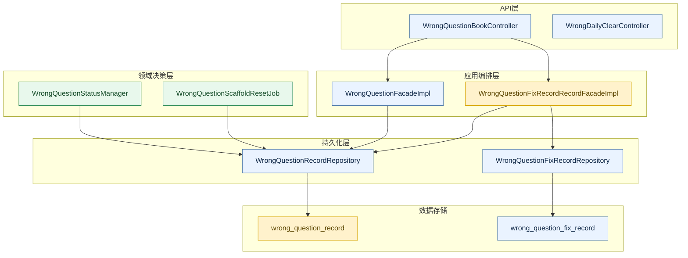
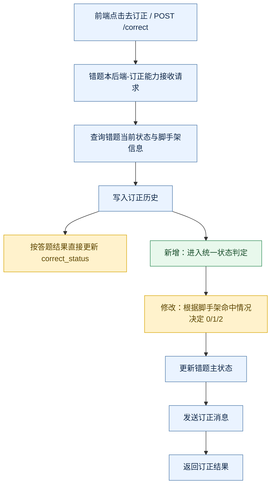
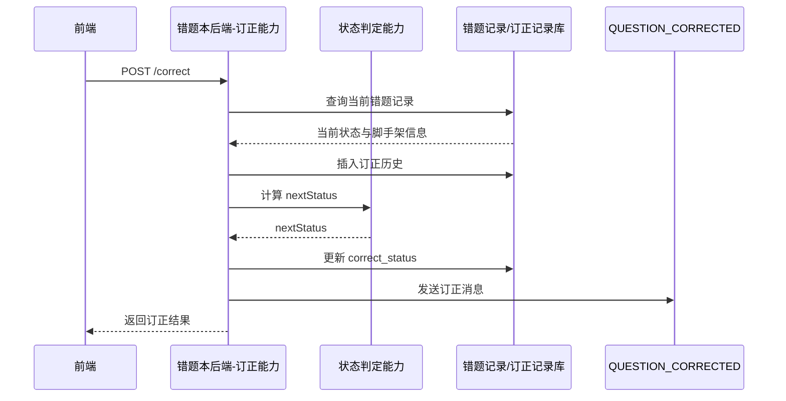
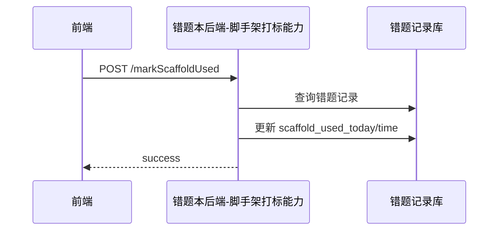
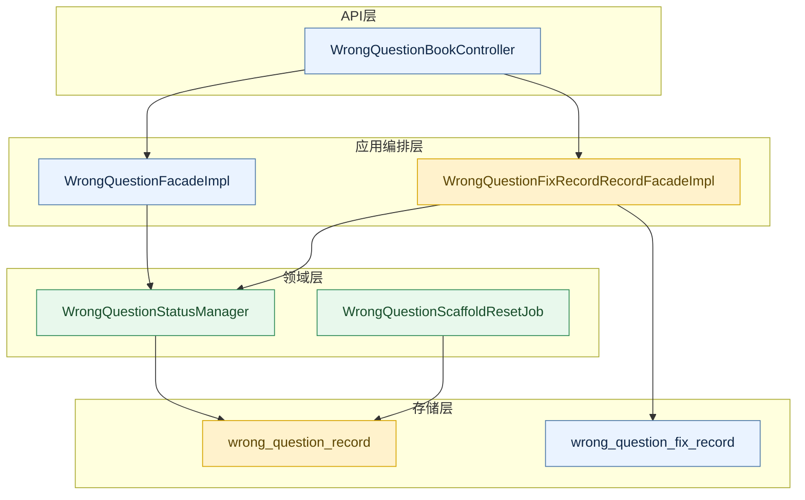

# Java 后端项目示例输入输出

## 什么时候读这份示例

当你处理的是典型 Java 后端项目，并且仓库里存在如下结构时，优先读这份示例：

- `Controller`
- `Facade` / `FacadeImpl`
- `Service`
- `Repository` / `Mapper`
- `Entity` / `Request` / `Response`
- `resources/mapper/*.xml`
- `Job` / `MQ` / `Dubbo`

这份示例展示的是“如何组织方案”，不是要求所有项目都照搬同一套模块拆分。

## 示例场景

### 示例主题

错题本订正流程优化：在原有 `未订正 / 已订正` 二态基础上，引入 `待验证` 状态，并增加脚手架打点、二级 TAB、跨天重置、统计口径修正。

### 示例输入

#### 输入文档

- `【澄清】错题本订正流程优化.md`
- `【需求】错题本订正流程优化.md`

#### 输入代码基线

- `WrongQuestionBookController.java`
- `WrongQuestionFixRecordRecordFacadeImpl.java`
- `WrongQuestionFacadeImpl.java`
- `WrongQuestionRecord.java`
- `WrongQuestionRecordResponse.java`
- `WrongQuestionRecordMapper.xml`
- `WrongQuestionStatisticsFacadeImpl.java`
- `WrongQuestionRecordRepositoryImpl.java`
- `WrongDailyClearRecordServiceImpl.java`

#### 已确认目标

- 原题订正状态从二态扩展为三态：
  - `0 = 未订正`
  - `1 = 已订正`
  - `2 = 待验证`
- 新增 `scaffold_used_today`、`scaffold_used_time`
- 待验证列表拆成 `新加入` 和 `可挑战`
- `待验证` 不计入红点、待消除数量、未订正统计
- 新增跨天重置任务，只重置 `scaffold_used_today`

## 示例输入如何转成方案

### 步骤 1：先写当前代码事实

不要一上来写目标方案。先把现状说实。

示例写法：

```markdown
## 2. 当前代码状态梳理

### 2.1 当前原题订正主链路仍是二态模型

当前 `WrongQuestionFixRecordRecordFacadeImpl.correct(...)` 的核心逻辑是：

- 先写入 `wrong_question_fix_record`
- 再直接按 `request.getResult()` 更新 `wrong_question_record.correct_status`

这意味着当前真实代码只支持：

- `0 = 未订正`
- `1 = 已订正`

当前代码并未把 `correct_status = 2` 接入原题订正主链路。
```

### 步骤 2：再写需求与现状差距

不要把差距藏在正文里，单独做一张表。

示例写法：

```markdown
## 3. 需求与当前代码差距

| 模块 | 当前代码 | 目标需求 | 结论 |
|---|---|---|---|
| 原题订正状态 | 仅支持 0/1 二态 | 支持 0/1/2 三态 | 需要改状态流转 |
| 脚手架打点 | 无独立接口 | 需要独立标记 `Today/T` | 需要新增接口 |
| 错题主表字段 | 无脚手架字段 | 新增 `scaffold_used_today/time` | 需要改表和代码 |
| 列表查询 | 不支持待验证二级 TAB | 支持 `新加入/可挑战` | 需要改查询口径 |
| 统计口径 | `未订正 = total - 已订正` | 待验证不计入未订正 | 需要修正统计 SQL |
```

### 步骤 3：最后输出目标方案

目标方案要回答“怎么改”，而不是重复需求。

## 示例输出片段

### 1. 文档说明

```markdown
# 错题本订正流程优化-后端方案设计

## 1. 文档说明

### 1.1 目标

本方案基于已澄清需求与当前仓库真实代码基线，设计错题本订正流程的后端增量改造方案。
目标是：

- 引入 `待验证` 业务状态
- 补齐脚手架打点与跨天重置能力
- 让列表、统计、日清、异步链路与新状态口径保持一致

### 1.2 输入来源

- 澄清文档：`【澄清】错题本订正流程优化.md`
- 原始需求文档：`【需求】错题本订正流程优化.md`
- 当前代码仓库：以本仓库当前 HEAD 为准
```

### 2. 当前代码基线

```markdown
### 1.3 当前代码基线

本次方案以当前仓库 HEAD 为准，关键基线来自：

- `jzx-wrong-question/.../WrongQuestionBookController.java`
- `jzx-wrong-question/.../WrongQuestionFixRecordRecordFacadeImpl.java`
- `jzx-wrong-question/.../WrongQuestionFacadeImpl.java`
- `jzx-wrong-question/.../WrongQuestionRecordMapper.xml`
- `jzx-wrong-question/.../WrongQuestionStatisticsFacadeImpl.java`
```

### 3. 整体改造落点图

这里的关键不是“画图”，而是让人一眼看清哪里是现有逻辑、哪里是变更、哪里是新增。
这张图是“模块落点图”，不是“功能流程图”；真正的流程要在后面的触发式流程图里展开。



图例：

- 蓝色：现有模块
- 橙色：现有模块但需改造
- 绿色：新增模块

### 3.1 触发式功能流程图示例

真正帮助评审理解业务改造的，不是模块关系，而是“从触发点开始，这个功能现在怎么跑、哪里改了、哪里新增了”。

例如原题订正能力，应优先画成下面这种图：



这类图的重点是：

- 起点必须是实际触发点
- 只围绕本次改动所在功能展开
- 老流程、修改点、新增点必须在同一条业务链路里被看见
- 如果查询链路、任务链路也很复杂，再继续拆成独立子流程图

### 3.2 关键架构考量示例（仅在相关时补充）

除了落点图和流程图，如果当前场景确实涉及架构取舍，还要补一段“为什么选这个方案”的分析，避免只剩代码改动清单。

例如，在“错题订正流程优化”这个案例里，真正相关的取舍可能只有下面几项：

| 维度 | 建议 | 原因 |
|---|---|---|
| 设计模式 | 复用统一状态机 | 主状态流转规则已经跨原题订正与日清复用，继续收口到状态机最合适 |
| 性能/并发 | 待验证子筛选下沉 SQL | 如果放到内存层会导致分页错乱，也会放大查询成本 |
| 安全 | 强化用户归属校验 | 打标、订正、日清推荐都直接操作用户错题记录，必须防越权 |
| 锁/幂等 | `待确认` | 如果前端可能重复提交订正，需要进一步确认是否补幂等控制 |

而像缓存、新中间件这类点，如果当前场景根本不相关，就不要为了形式完整硬补。

如果这里存在阻塞型歧义，不要只写一句“待确认”，而要把问题写清楚。例如：

```markdown
当前观察：
- 当前 `/correct` 会写入 `wrong_question_fix_record`
- 现有代码里没有看到显式幂等控制

影响点：
- 如果前端存在重复点击或弱网重试，可能影响“是否需要补幂等方案”的设计决策

可选方案：
1. 保持现状，不补幂等
2. 在接口层补幂等键或防重控制

推荐方案：
- 暂不拍板
- 先确认前端是否存在自动重试或重复提交场景，再决定是否需要补幂等

待确认问题：
- `/correct` 是否存在前端自动重试、重复点击或网关重放场景，需要我们把幂等设计纳入本次方案？
```

### 4. 关键任务级时序图

建议拆成多张图。比如原题订正提交和脚手架标记不要混在一起。
participant 要站在“交互角色”视角命名，类名放到实现映射里。

#### 4.1 原题订正提交



实现映射：

- `POST /study/rest/wrongQuestionBook/correct`
- `WrongQuestionFixRecordRecordFacadeImpl.correct(...)`
- `WrongQuestionBookController.correct(...)`
- `WrongQuestionStatusManager.calculateNextStatus(...)`

#### 4.2 标记脚手架使用



### 5. 核心改动清单

```markdown
## 11. 核心改动清单

### 11.1 需要修改的现有文件

| 文件 | 改动点 |
|---|---|
| `WrongQuestionBookController.java` | 新增 `markScaffoldUsed` 接口 |
| `WrongQuestionFixRecordRecordFacadeImpl.java` | 接入状态管理器，改造 `correct(...)`，新增 `markScaffoldUsed(...)` |
| `WrongQuestionRecord.java` | 新增 `scaffoldUsedToday/scaffoldUsedTime` |
| `WrongQuestionRecordMapper.xml` | 增加字段映射、待验证筛选、跨天重置 SQL |
| `WrongQuestionStatisticsFacadeImpl.java` | 调整统计口径，不把 `correct_status=2` 算入未订正 |

### 11.2 需要新增的文件

| 文件 | 作用 |
|---|---|
| `WrongQuestionStatusManager.java` | 承载状态流转与二级 TAB 判定 |
| `MarkScaffoldUsedRequest.java` | 脚手架标记请求体 |
| `PendingVerifyTabType.java` | 待验证二级 TAB 枚举 |
| `WrongQuestionScaffoldResetJob.java` | 跨天重置 `scaffold_used_today` |
```

### 6. 新旧逻辑差异

这部分必须独立成节，方便评审快速看懂变化面。

```markdown
## 12. 新旧逻辑差异

| 维度 | 旧逻辑 | 新逻辑 |
|---|---|---|
| 订正状态 | 仅 `0/1` | 扩展为 `0/1/2` |
| 脚手架记录 | 无持久化 | 落错题主表 `Today/T` |
| 待验证列表 | 不存在 | 支持 `新加入/可挑战` |
| 统计口径 | `total - corrected` | 显式统计 `0/1`，排除 `2` |
| 跨天行为 | 无重置 | 定时任务重置 `scaffold_used_today` |
```

### 7. 数据存储与持久化写法

数据存储设计不能只写“新增两个字段”，至少要写到口径和兼容性。

```markdown
## 10. 数据存储与持久化设计

### 10.1 表结构 / 存储结构变更

表：`wrong_question_record`

新增字段：

| 字段 | 类型 | 默认值 | 说明 |
|---|---|---:|---|
| `scaffold_used_today` | int | 0 | 今日是否使用过脚手架 |
| `scaffold_used_time` | bigint | null | 最近一次使用脚手架时间 |

### 10.2 查询与写入口径

- 列表查询新增 `pendingVerifyTabType`
- `correct_status = 2` 时，按 `scaffold_used_time` 判断 `新加入 / 可挑战`
- 统计接口改为显式统计：
  - `uncorrectedCount = correct_status = 0`
  - `correctedCount = correct_status = 1`

### 10.3 DDL / SQL / 持久化草案

~~~sql
ALTER TABLE wrong_question_record
    ADD COLUMN scaffold_used_today INT NOT NULL DEFAULT 0 COMMENT '今日是否使用过脚手架',
    ADD COLUMN scaffold_used_time BIGINT NULL COMMENT '最近一次使用脚手架时间';
~~~
```

### 8. 接口设计与兼容发布写法

如果模板里有 `接口设计`、`兼容性、发布与回滚`，示例也要显式给出来，不要只在正文里顺手提一句。

```markdown
## 9. 接口设计

### 9.1 `POST /study/rest/wrongQuestionBook/correct`

- 当前状态：已存在，当前只支持 `0/1` 二态订正
- 本次改造点：接入统一状态判定，允许返回 `0/1/2`
- 请求字段：沿用现有 `result`、`questionId`；无需新增脚手架字段
- 响应字段：补充 `correctStatus` 当前值，便于前端刷新列表态
- 查询或校验规则：必须校验用户归属；若当前记录不存在则直接返回业务错误

### 9.2 `POST /study/rest/wrongQuestionBook/markScaffoldUsed`

- 当前状态：新增接口
- 本次改造点：只负责打标 `scaffold_used_today/time`，不直接改 `correct_status`
- 请求字段：`questionId`
- 响应字段：`success`
- 查询或校验规则：仅允许标记当前用户自己的错题记录

## 14. 兼容性、发布与回滚

- 老接口兼容：`/correct` 保持原路径与主请求结构不变
- 老数据兼容：历史数据默认 `scaffold_used_today = 0`，`scaffold_used_time = null`
- 发布顺序：先发 DDL，再发应用，再开启跨天任务
- 回滚策略：若应用回滚，新增字段保留但不参与旧逻辑；跨天任务先停用
```

### 9. 测试与风险写法

测试和风险要写出“为什么会错”。

```markdown
## 15. 测试方案

- `0 -> 1`：未使用脚手架且答对
- `0 -> 2`：使用脚手架后答对
- `2 -> 2`：当天再次答对仍保持待验证
- `2 -> 1`：跨天独立答对转已订正
- 待验证二级 TAB：当天数据进入 `新加入`，跨天数据进入 `可挑战`
- 统计接口：`correct_status = 2` 不计入未订正和已订正
- 跨天任务：仅重置 `scaffold_used_today`，不清空 `scaffold_used_time`

## 16. 风险与待确认项

| 风险或待确认项 | 触发点 | 影响 | 应对 |
|---|---|---|---|
| 统计误算待验证 | 旧统计使用 `total - corrected` | 待验证被错误计入未订正 | 改为显式统计 `0/1` |
| 列表 total 与分页不一致 | 若在内存里二次筛选 TAB | 前端分页错乱 | 在 SQL 层完成筛选 |
| MQ 语义漂移 | `QUESTION_CORRECTED` 可能被下游理解为最终已订正 | 下游状态错误 | 下游回查主表状态或扩展消息载荷 |
```

## 从这个示例里学什么

### 局部交付模式示例

如果用户当前只要求一个局部产物，不要强行切成完整方案。

例如用户输入：

```text
先别写完整后端方案，帮我画一下这次需求涉及哪些模块改动。
```

这时更合适的输出不是完整模板，而是一个显式声明范围的局部交付稿。示例：

```markdown
# 错题本订正流程优化-后端改造落点图（局部交付）

> 本次仅输出“后端改造落点图”这一局部产物，用于帮助评审快速识别改动模块与职责边界。
> 这不是完整后端方案，未覆盖需求与现状差距、关键流程图、接口设计、测试方案、发布回滚与风险章节。

## 1. 本次局部交付范围

- 输出目标：识别本次需求涉及哪些后端模块需要修改或新增
- 不覆盖内容：
  - 完整差距分析
  - 关键流程图
  - 接口时序图
  - 完整接口设计
  - 数据存储与持久化设计
  - 测试方案
  - 发布回滚与风险

## 2. 最小必要代码基线

当前判断改动范围时，最小必要代码基线来自：

- `WrongQuestionBookController.java`
- `WrongQuestionFixRecordRecordFacadeImpl.java`
- `WrongQuestionFacadeImpl.java`
- `WrongQuestionStatusManager.java`
- `WrongQuestionRecordMapper.xml`

## 3. 后端改造落点图



图例：

- 蓝色：现有模块
- 橙色：现有模块但需改造
- 绿色：新增模块

## 4. 本图能回答什么，不能回答什么

- 能回答：
  - 这次改动落在哪些后端模块
  - 哪些模块是新增，哪些是存量改造
  - 改动对哪些存储对象有影响
- 不能回答：
  - 具体状态如何流转
  - 哪个入口先执行、哪个规则后判断
  - 接口字段与兼容策略如何设计

如果后续用户要把它升级成完整评审稿，再继续补：

1. 需求与当前代码差距
2. 关键流程图
3. 接口时序图
4. 接口设计
5. 数据存储与持久化设计
6. 测试、发布回滚与风险
```

### 应该学

- 先写当前代码基线，再写目标方案
- 差距单独成节
- 后端改造落点图和关键流程图分开表达
- 图表只服务于关键问题
- 变更点要落到类、方法、表、SQL、任务
- 风险要写具体机制

### 不要学

- 不要把示例里的类名、模块名硬套到别的项目
- 不要把“新增一个 Manager”当成必须动作
- 不要把落点图画完就当作流程图已经交代清楚
- 不要因为示例里有 SQL 草案，就在所有项目里强行写完整 DDL

## 最后提醒

对 Java 后端方案来说，最常见的坏味道不是“结构不完整”，而是：

- 看起来章节很全，但没有真实代码基线
- 画了很多图，但没有指出旧逻辑和改动点
- 列了很多改动，但没有说明统计口径、异步语义和兼容策略

这份示例的价值，就是避免方案写成“会开会、不能落地”的文档。
