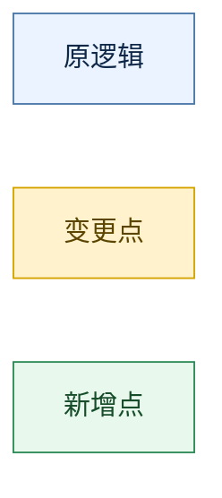

# 后端详细技术方案模板

> 这是固定输出骨架。可以补充章节，但不要删除核心章节。
> 仅当用户要“完整后端技术方案 / 评审稿”时使用这套骨架；如果用户只要求单个局部产物（如改造落点图、单张流程图、局部接口设计），按主 skill 的“局部交付模式”输出，不要强行套完整模板。

## 1. 文档说明

### 1.1 目标

- 这份方案要解决什么问题
- 为什么需要这份后端方案

### 1.2 输入来源

- 澄清文档
- 原始需求文档或 PRD
- 当前代码仓库
- 其他补充材料

### 1.3 当前代码基线

- 本次方案以哪个分支或 HEAD 为准
- 关键代码文件、模块、表、任务、依赖来自哪里

## 2. 当前代码状态梳理

按真实代码说明当前主链路、状态、接口、数据结构、统计口径、异步链路、任务或缓存逻辑。

## 3. 需求与当前代码差距

推荐表格字段：

| 模块 | 当前代码 | 目标需求 | 结论 |
|---|---|---|---|

## 4. 本次方案的设计原则

- 单一真相在哪里
- 哪些模块联动，哪些模块不联动
- 本次方案是最小侵入、增量改造，还是允许重构

## 5. 整体架构设计

### 5.1 后端改造落点图

要求：

- 必须体现原逻辑、变更点、新增点
- 使用 Mermaid
- 这是“改造落点/模块关系”的辅助图，不能替代第 7 节的功能流程图
- 颜色语义固定：
  - 原逻辑：蓝色
  - 变更点：橙色
  - 新增点：绿色

推荐图例：



### 5.2 后端边界说明

- 哪些数据或状态由哪个模块维护
- 哪些上下游只读，哪些可写
- 哪些能力不在本次方案范围内

### 5.3 关键架构考量（按需）

只有当当前需求、现有代码或预期风险真的涉及架构取舍时，才补这一节。

可选角度包括：

- 是否需要引入或复用设计模式
- 是否需要缓存
- 是否需要锁、幂等或防重控制
- 是否存在明显的性能/并发问题
- 是否需要补充安全与稳定性设计
- 是否需要引入新技术或中间件

要求：

- 只分析本次场景真正相关的点
- 相关时要写清“推荐方案 + 原因 + 替代方案（如有）”
- 如果是否引入会明显影响方案选择，但缺少前提，则标记 `待确认` 并暂停确认
- 如果不相关，可以直接省略，不需要机械补全所有维度

### 5.4 改造后的职责划分

按模块说明职责变化。

## 6. 核心业务模型

可按以下角度选用：

- 状态模型
- 核心字段模型
- 关键枚举
- 统一判定口径

## 7. 关键流程图

至少覆盖一条主链路。复杂需求建议拆成多张：

- 主提交流程
- 查询流程
- 标记或补偿流程
- 跨天任务或批处理流程

要求：

- 每张图必须从实际触发点开始，例如：接口入口、定时任务、MQ 消费、用户点击动作
- 每张图优先围绕“本次改动所在模块/功能”展开，不要用抽象层级框图替代功能流程
- 图中只展示本次方案真正需要关心的主步骤；复杂逻辑拆分成多张子流程图
- 每张图下补一句“这张图回答什么问题”
- 每张图都使用同一套颜色语义
- 图中要显式区分：老流程、修改点、新增流程

## 8. 接口时序图

按任务或用例拆图，不要一图包打天下。

每张图建议包含：

- 参与方
- 请求入口
- 关键读写
- 状态判定
- 异步或下游调用
- 实现映射

额外要求：

- `participant` 必须优先使用交互角色或分层概念命名，例如：`前端`、`后端-订正能力`、`题目服务`、`Redis`、`数据库`、`MQ`
- 不要默认直接把 Controller / Facade / Service / Repository / Mapper 类名写进 participant
- 如果一个交互方背后有多个类协作，图中仍保留一个“功能模块” participant，具体类名下沉到“实现映射”
- 除非用户明确要求类级设计，否则时序图不要堆大量类名

## 9. 接口设计

按接口列出：

- 路径或 RPC 方法
- 当前状态
- 本次改造点
- 请求字段
- 响应字段
- 查询或校验规则

如无新增或变更接口，也要明确写“无”，并说明本次只涉及内部编排调整。

## 10. 数据存储与持久化设计

### 10.1 表结构 / 存储结构变更

列出：

- 新增字段、键或集合结构
- 含义
- 默认值或初始化策略
- 是否允许为空 / 缺省
- 是否涉及历史数据回填 / 迁移

如果是关系型数据库，按表、字段、索引写；如果是 KV / 文档 / 搜索 / 缓存等存储，改写成键设计、索引、TTL、版本兼容或消息持久化策略。

### 10.2 查询与写入口径

列出：

- 新增查询条件
- 统计口径变化
- 排序规则变化
- 是否需要新索引

### 10.3 DDL / SQL / 持久化草案

如果需要，给出建议 SQL、键设计、索引方案或持久化伪代码；如果暂不确定，也要说明原因与后续验证方式。
如果本次没有任何存储改动，也要明确写“无”。

## 11. 核心改动清单

推荐分两类：

- 需要修改的现有文件 / 模块
- 需要新增的文件 / 模块

## 12. 新旧逻辑差异

必须独立成节，推荐表格：

| 维度 | 旧逻辑 | 新逻辑 |
|---|---|---|

至少覆盖：

- 状态流转
- 接口行为
- 数据模型
- 统计口径
- 异步行为
- 任务行为

## 13. 依赖与上下游影响

列出：

- 外部服务
- MQ
- 缓存
- 定时任务
- 其他系统或团队的配合点

## 14. 兼容性、发布与回滚

至少考虑：

- 老接口兼容
- 老数据兼容
- 先后发布顺序
- 失败时的回滚或兜底策略

## 15. 测试方案

至少包括：

- 主链路
- 边界分支
- 异常分支
- 兼容性
- 统计口径
- SQL / 存储变更验证
- 异步链路验证

## 16. 风险与待确认项

推荐表格：

| 风险或待确认项 | 触发点 | 影响 | 应对 |
|---|---|---|---|

如果存在“阻塞方案定稿”的待确认项，建议在本节后追加一个可直接发给人的确认块，格式如下：

```markdown
### 待人工确认问题 1

当前观察：
- ...

影响点：
- 这会影响方案中的 ...

可选方案：
1. ...
2. ...

推荐方案：
- 建议选 ...
- 原因是 ...

待确认问题：
- 是否 ...
```

## 17. 结论

- 这次方案的核心改造方向
- 与当前代码真实现状相比，最大的变化是什么
- 推进实施时最需要优先关注什么
